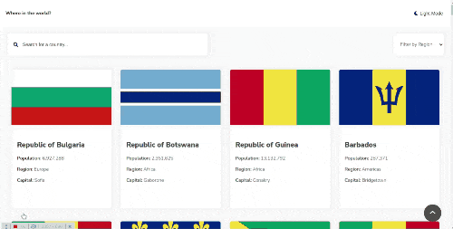

# Frontend Mentor - REST Countries API with color theme switcher solution

This is a solution to the [REST Countries API with color theme switcher challenge on Frontend Mentor](https://www.frontendmentor.io/challenges/rest-countries-api-with-color-theme-switcher-5cacc469fec04111f7b848ca). Frontend Mentor challenges help you improve your coding skills by building realistic projects. 

## Table of contents

- [Overview](#overview)
  - [The challenge](#the-challenge)
  - [Screenshot](#screenshot)
  - [Links](#links)
- [My process](#my-process)
  - [Built with](#built-with)
  - [What I learned](#what-i-learned)
  - [Continued development](#continued-development)
  - [Useful resources](#useful-resources)
- [Author](#author)
- [Acknowledgments](#acknowledgments)

## Overview

### The challenge

Users should be able to:

- See all countries from the API on the homepage
- Search for a country using an `input` field
- Filter countries by region
- Click on a country to see more detailed information on a separate page
- Click through to the border countries on the detail page
- Toggle the color scheme between light and dark mode *(optional)*

### Screenshot



### Links

- Solution URL: [https://github.com/andresgrdn/rest-countries-api-with-color-theme-switcher](https://github.com/andresgrdn/rest-countries-api-with-color-theme-switcher#overview)
- Live Site URL: [https://flags-finder.netlify.app/](https://flags-finder.netlify.app/)

## My process

### Built with

- Semantic HTML5 markup
- Mobile-first workflow
- For the styles I used pure CSS

### What I learned

Use this section to recap over some of your major learnings while working through this project. Writing these out and providing code samples of areas you want to highlight is a great way to reinforce your own knowledge.

To see how you can add code snippets, see below:

```html
<h1>Some HTML code I'm proud of</h1>
```
```css
.proud-of-this-css {
  color: papayawhip;
}
```
```js
const proudOfThisFunc = () => {
  console.log('🎉')
}
```

If you want more help with writing markdown, we'd recommend checking out [The Markdown Guide](https://www.markdownguide.org/) to learn more.

**Note: Delete this note and the content within this section and replace with your own learnings.**

### Useful resources
- [Select element | WhatWC website](https://html.spec.whatwg.org/multipage/form-elements.html#the-select-element)
- [Select element | MDN website](https://developer.mozilla.org/en-US/docs/Web/HTML/Element/select)
- [Other option to the select element | MDN website](https://developer.mozilla.org/en-US/docs/Learn/Forms/Other_form_controls#drop-down_controls)

## Author

- Website - [andresgrdn.github.io](https://andresgrdn.github.io)
- Frontend Mentor - [@andresgrdn](https://www.frontendmentor.io/profile/andresgrdn)
- Twitter - [@andresgrdn](https://www.twitter.com/andresgrdn)
